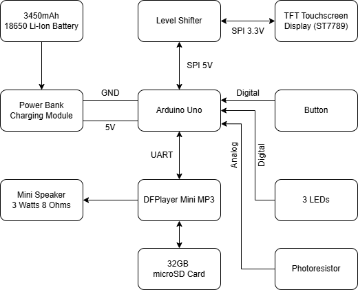
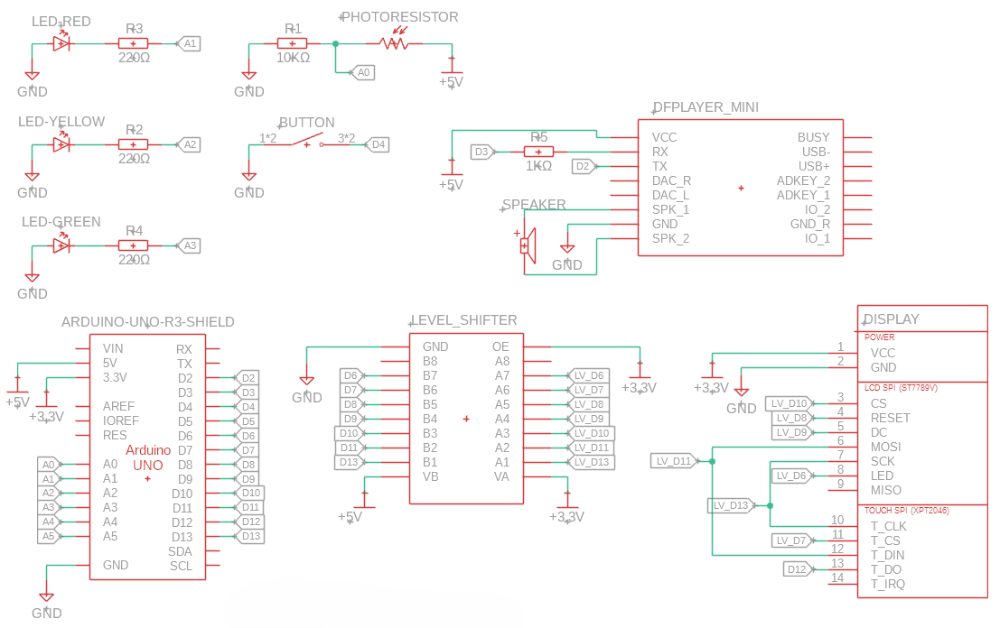

# Connect-4-Console
PM Fair

## Introducere

Proiectul constă în realizarea unei console hardware independente pe care rulează clasicul joc de societate.

- **Ce face:** Permite la doi jucători să joace Connect 4 pe un ecran TFT, jocul fiind însoțit de efecte sonore și muzică redate printr-un modul MP3 dedicat, totul fiind alimentat portabil de un acumulator integrat.
- **Scopul lui:** Replicarea fizică a unui joc de strategie cunoscut, combinând o interfață grafică digitală cu feedback audio pentru o experiență interactivă completă.
- **Ideea de la care am pornit:** Mi-am dorit să aduc un joc al copilăriei în format digital, construind o mini-consolă portabilă de tip arcade. Am vrut să explorez modul în care un microcontroller poate gestiona simultan grafică, logică de joc și redare audio.
- **Utilitate:** Este un proiect excelent de divertisment, dar și o dovadă de concept (PoC) pentru integrarea a multiple periferice (display SPI, modul audio UART, management de putere) pe o singură placă de dezvoltare, depășind limitările clasice de curent ale acesteia.

## Descriere generală

Arhitectura proiectului este centrată pe placa Arduino, care acționează ca unitate centrală de procesare. Arduino preia input-ul de la utilizator (butoane/joystick), actualizează logica matricei de joc, trimite comenzi de desenare către ecranul TFT și comenzi de redare audio către modulul DFPlayer Mini.

Pentru a susține consumul ridicat al ecranului și al difuzorului, sistemul este susținut de un circuit de management al puterii separat (Battery Shield), care preia energia de la acumulatorul Li-Ion și livrează o tensiune stabilă întregului circuit.

### Schema Bloc a interacțiunilor

- **Sursa de alimentare (Battery Shield V3):** Oferă 5V constanți și un curent de până la 3A către breadboard.
- **Creierul (Arduino Uno):** Primește 5V de la breadboard și coordonează perifericele.
- **Input (Butoane/Joystick):** Trimite semnale digitale/analogice către pinii Arduino pentru selectarea coloanei.
- **Output Vizual (Display TFT):** Comunică cu Arduino prin protocolul SPI pentru a randa interfața grafică și piesele care cad.
- **Output Audio (DFPlayer Mini + Difuzor 3W):** Comunică cu Arduino via UART (Serial). Citește efectele sonore de pe cardul MicroSD și le amplifică direct în difuzor.

## Hardware Design

### Lista de piese

- 1 x Placă de dezvoltare (tip Arduino Uno)
- 1 x Display TFT (ex: 2.4" sau 2.8" SPI)
- 1 x Modul audio DFPlayer Mini MP3
- 1 x Card MicroSD (max 32GB, formatat FAT32)
- 1 x Difuzor Mini (3W, 8 Ohmi)
- 1 x Modul Powerbank (Battery Shield V3 18650, ieșire 5V/3A)
- 1 x Acumulator Li-Ion Samsung 18650 (3.6V, 3450mAh, 8A)
- Butoane push sau 1 x Joystick (pentru control)
- 1 x Breadboard
- Fire de conexiune (Dupont tată-tată, mamă-tată)
- Rezistențe (ex: 1k Ohm pentru TX-ul către DFPlayer, rezistențe de pull-down pentru butoane)

## Software Design

### Mediu de dezvoltare

- Proiectul va fi dezvoltat folosind mediul **Arduino IDE**.

### Librării utilizate

- `SPI.h` - pentru comunicarea hardware cu display-ul.
- `Adafruit_GFX.h` și librăria specifică controllerului ecranului (ex: `Adafruit_ILI9341.h`) - pentru randarea graficii (cercuri, linii, text).
- `SoftwareSerial.h` - pentru a crea un port serial virtual pe alți pini pentru a comunica cu playerul MP3.
- `DFRobotDFPlayerMini.h` - pentru controlul simplificat al modulului audio (play, pause, setare volum).

### Logica jocului (Algoritmi)

- **Matricea de stare:** O matrice de int-uri de `6x7` va reprezenta tabla de joc (`0 = gol`, `1 = jucător 1`, `2 = jucător 2`).
- **Animația:** Când un jucător alege o coloană, un algoritm va găsi cel mai de jos rând disponibil (`0`) din acea coloană, va schimba starea în matrice și va declanșa o funcție grafică de desenare a unui cerc colorat la coordonatele X/Y corespunzătoare.
- **Efecte Sonore:** În momentul „căderii” piesei, se trimite o comandă serială către DFPlayer pentru a reda „track 1” (sunet de piesă lovind tabla).
- **Algoritmul de Victorie:** După fiecare mutare, o funcție scanează matricea pentru a găsi 4 elemente identice pe orizontală, verticală și diagonale. Dacă se returnează `true`, jocul se oprește, se afișează mesajul de victorie pe TFT și se redă sunetul specific.

## Rezultate Obţinute

În urma implementării, a rezultat o consolă independentă, portabilă și stabilă. Principala realizare hardware a fost echilibrarea consumului de curent. Utilizând modulul separat de alimentare (Battery Shield) și setându-l în modul `HOLD`, sistemul poate rula concomitent grafică pe TFT și redare audio puternică (difuzor de 3W) fără ca microcontrollerul să sufere căderi de tensiune (`brown-out resets`). Autonomia estimată cu bateria de 3450mAh este de câteva ore bune de funcționare continuă.

## Concluzii

Proiectul a demonstrat cât de important este managementul corect al alimentării în sistemele embedded. Cea mai mare provocare nu a fost neapărat logica jocului, ci înțelegerea limitărilor hardware ale plăcii de dezvoltare și depășirea lor (ocolirea regulatorului intern de pe Arduino pentru a susține consumul perifericelor). Combinația de feedback vizual pe TFT și efecte sonore clare pe DFPlayer creează o experiență foarte „polisată” a unui simplu joc de masă.

## Demo

## Jurnal

- **01.05.2026:** Achiziția componentelor și planificarea schemei bloc.
- **04.05.2026:** Introducerea documentației sumare (prima versiune).
- **09.05.2026:** Implementarea hardware-ului.

## Bibliografie / Resurse

### Resurse Hardware

- Datasheet DFPlayer Mini / Cip Amplificator 8002
- Specificații tehnice Acumulator 18650 Samsung 35E
- Pinout și specificații Arduino Uno

### Resurse Software

- DFPlayer Mini Library
- Adafruit GFX Library Reference
- Tutoriale despre limitările sistemelor de fișiere (`FAT32 vs exFAT`) pentru microcontrolere.
